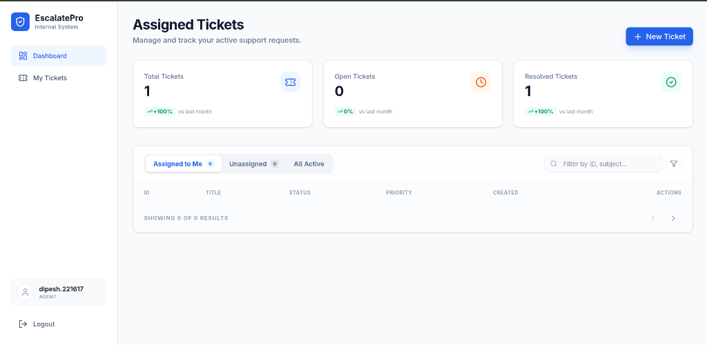
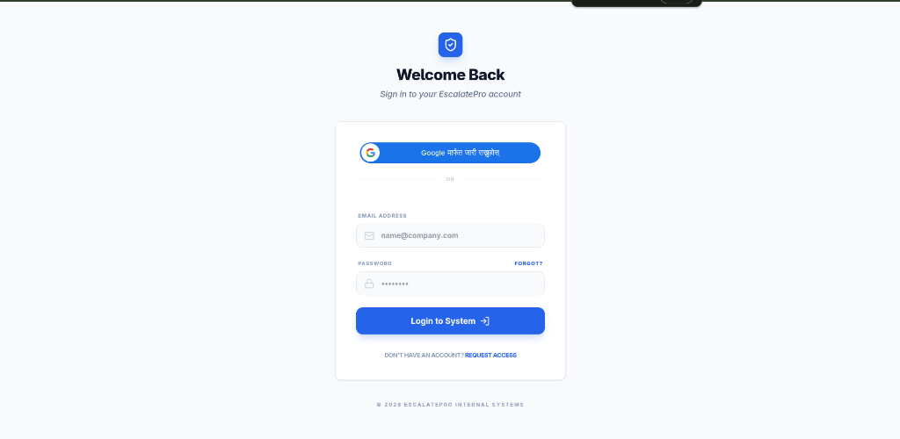
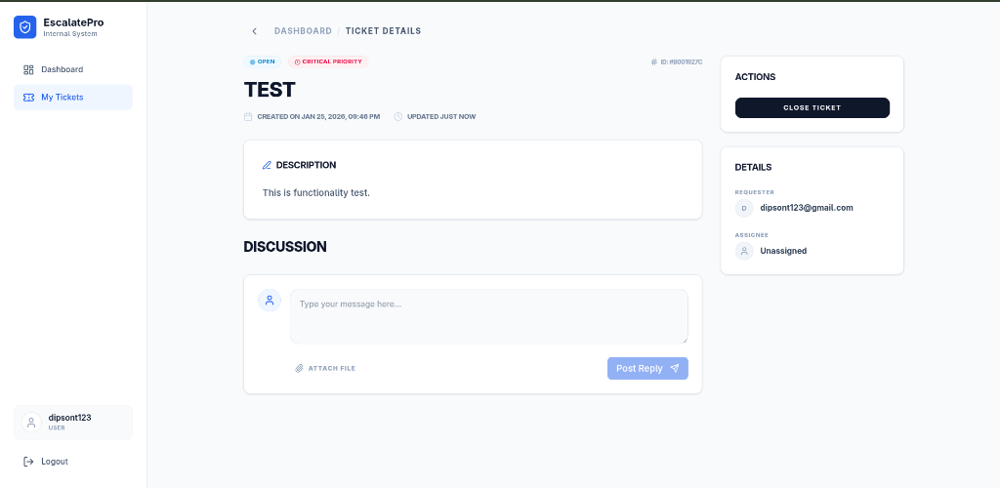

# EscalatePro Support Engine 🚀

A high-performance ticketing system with automated escalation, real-time analytics, and a premium dashboard experience.

### ✨ Core Features
- **Smart Queue**: Real-time ticket management with role-based dashboards (Customer, Support, Admin).
- **Automated Escalation**: Background engine that prioritizes stalling tickets.
- **Dynamic Analytics**: Live performance trends (Current vs Last Month).
- **Secure Auth**: JWT-based authentication with Google Sign-In integration.

---

### 🚀 Quick Setup

#### 1. Backend (Django)
- `cd backend`
- `pip install -r requirements.txt`
- `python manage.py migrate`
- `python manage.py runserver`

#### 2. Frontend (React + Vite)
- `cd frontend`
- `npm install`
- `npm run dev`

---

### 📸 System Preview

| Login Page | Ticket Details |
| :---: | :---: |
|  |  |

---